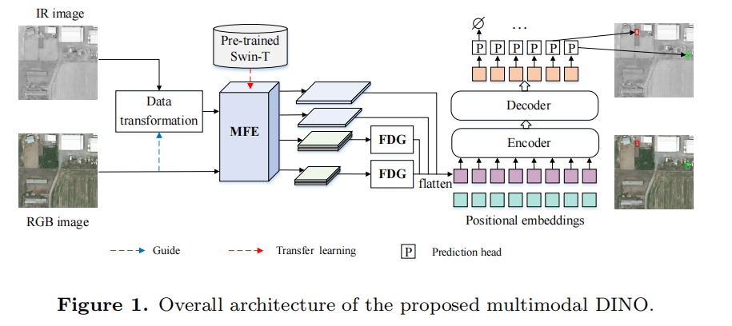
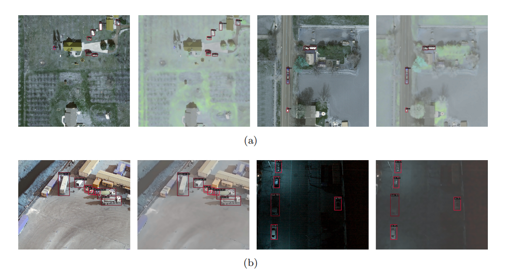

## multimodal DINO
Codes for ***Adaptive Multimodal Feature Fusion with Frequency Domain Gate for Remote Sensing Object Detection***

Yinhui Yu,Xu Sun,Qing Cheng

## Update
- [2023/10] This code will be released soon.

### ⚙ Network Architecture

**2. Data Preparation**

The unsupervised drone images we collected will soon be provided with a download link to Google Cloud Drive.

**3. The visualizing detection results of our approach on the Visdrone and UAVDT datasets.**

